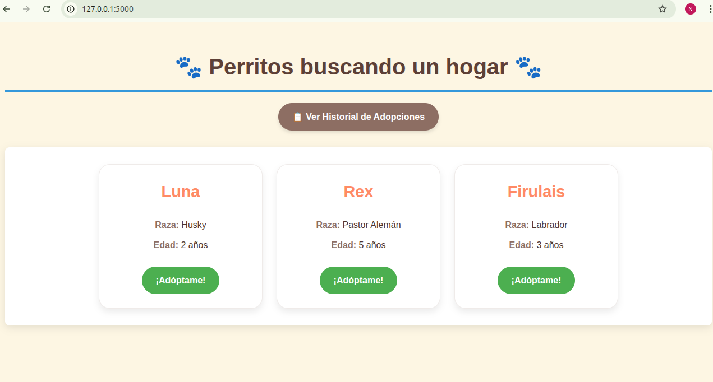
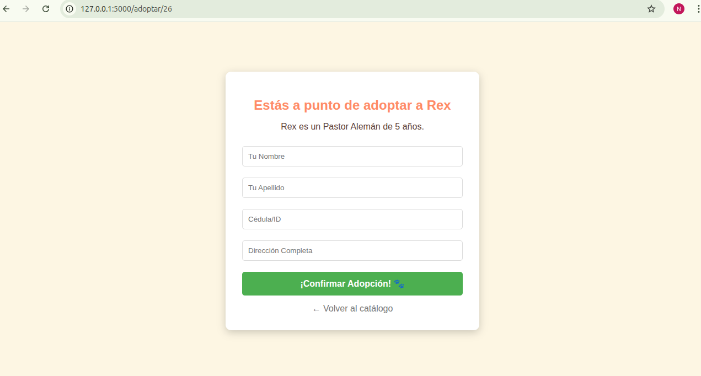
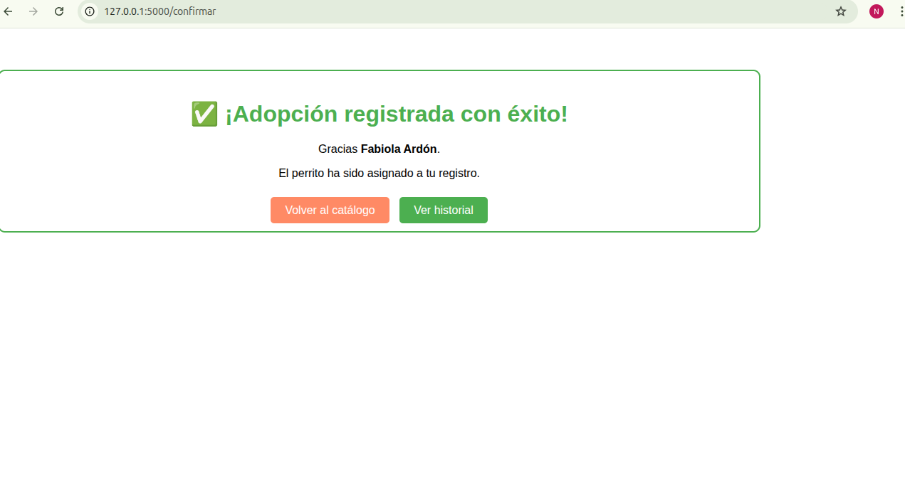
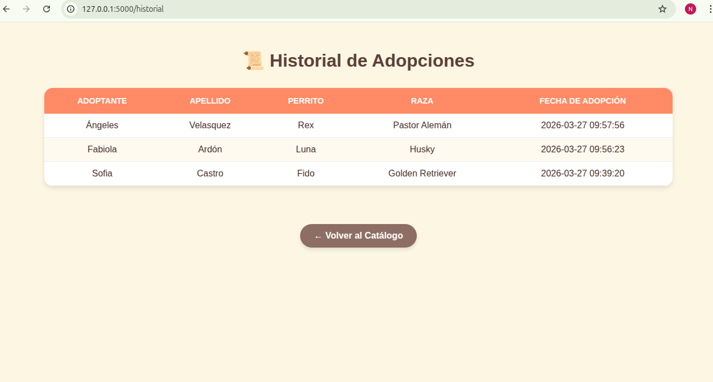

# 🐾 Centro de Adopción "Nancy"

Sistema de gestión para un **Centro de Adopción de Mascotas** desarrollado con Python y Flask. Este proyecto permite visualizar perros disponibles y registrar adopciones de forma segura.

## Capturas del Proyecto

## Funcionalidades
* **Catálogo:** Visualización de perritos desde MySQL.
* **Adopciones:** Formulario para registrar nuevos dueños.
* **Registro de Adopción:** Uso de SQL para asegurar que los datos se guarden correctamente.
* **Historial:** Registro de todas las adopciones realizadas.

## Tecnologías
* **Lenguaje:** Python 3
* **Framework:** Flask
* **Base de Datos:** MySQL
* **Sistema Operativo:** Linux

Puntos Clave del Proyecto
Transacciones SQL Atómicas: El sistema utiliza la lógica de COMMIT y ROLLBACK. Esto asegura que el registro del adoptante y el cambio de estado del perro se realicen como una sola unidad; si uno falla, el otro no se guarda, manteniendo la integridad de la base de datos.

Seguridad contra Inyección SQL: Todas las consultas a la base de datos están parametrizadas, lo que impide que atacantes externos manipulen el sistema a través de los formularios.

Interfaz Dinámica (Jinja2): El catálogo se genera en tiempo real. El sistema filtra automáticamente los perros ya adoptados y muestra alertas personalizadas si no hay mascotas disponibles en el inventario.

Arquitectura Limpia en Linux: El código está organizado de forma modular, separando la configuración, la lógica de base de datos y las rutas del servidor para facilitar el mantenimiento y escalabilidad.

Tecnologías Utilizadas
Lenguaje: Python 3 (entorno virtual venv).

Framework: Flask (manejo de rutas y plantillas).

Base de Datos: MySQL Server (modelo relacional).

S.O.: Linux (desarrollo y despliegue vía terminal).

Estructura del Repositorio
app.py: Controlador principal de las peticiones.

database.py: Funciones de conexión y transacciones SQL.

templates/: Vistas dinámicas en HTML.

static/: Estilos CSS y recursos visuales.
